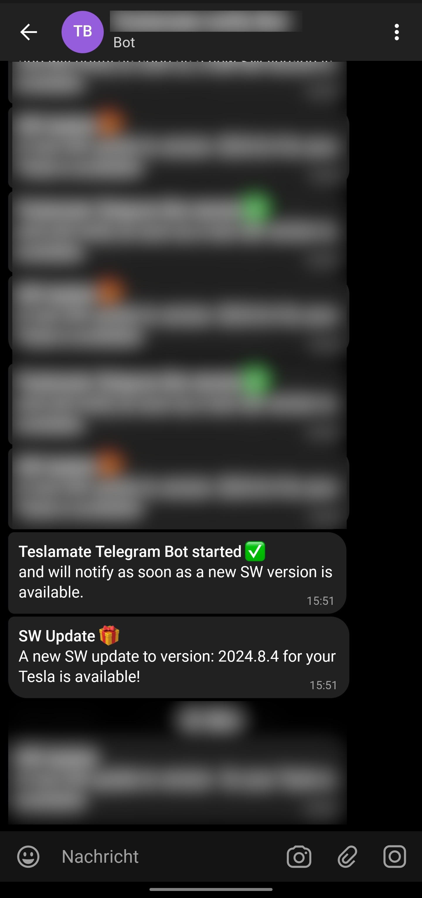

# TeslaMate Telegram Bot

[](https://github.com/JakobLichterfeld/TeslaMate-Telegram-Bot/actions/workflows/devops.yml)
[](https://github.com/JakobLichterfeld/TeslaMate-Telegram-Bot/actions/workflows/buildx.yml)
[](https://hub.docker.com/r/teslamatetelegrambot/teslamatetelegrambot)
[](https://hub.docker.com/r/teslamatetelegrambot/teslamatetelegrambot)
[](https://hub.docker.com/r/teslamatetelegrambot/teslamatetelegrambot)
[](https://www.paypal.com/cgi-bin/webscr?cmd=_s-xclick&hosted_button_id=ZE9EHN48GYWMN&source=url)

This is a telegram bot written in Python to notify by Telegram message when a new SW update for your Tesla is available. It uses the MQTT topic which [TeslaMate](https://github.com/adriankumpf/teslamate) offers.

## Screenshots

<p align="center">
  
</p>

## Table of contents

- [TeslaMate Telegram Bot](#teslamate-telegram-bot)
  - [Screenshots](#screenshots)
  - [Table of contents](#table-of-contents)
  - [Features](#features)
  - [Requirements](#requirements)
  - [Installation](#installation)
  - [Update](#update)
  - [NixOS Installation](#nixos-installation)
    - [Additional Requirements](#additional-requirements)
    - [Instructions](#instructions)
  - [Contributing](#contributing)
  - [Donation](#donation)
  - [Disclaimer](#disclaimer)

## Features

- [x] Sends a telegram message to you if an update for your tesla is available

## Requirements

- A Machine that's always on and runs [TeslaMate](https://github.com/adriankumpf/teslamate)
- Docker _(if you are new to Docker, see [Installing Docker](https://docs.docker.com/engine/install/) and [Docker Compose](https://docs.docker.com/compose/install/linux/))_
- External internet access, to send telegram messages.
- A mobile with [Telegram](https://telegram.org/) client installed
- your own Telegram Bot, see [Creating a new telegram bot](https://core.telegram.org/bots#6-botfather)
- your own Telegram chat ID, see [get your telegram chat ID](https://docs.influxdata.com/kapacitor/v1.5/event_handlers/telegram/#get-your-telegram-chat-id)

## Installation

Make sure you fulfill the [Requirements](#requirements).

It is recommended to backup your data first.

This document provides the necessary steps for installation of TeslaMate Telegram Bot on an any system that runs Docker.

This setup is recommended only if you are running TeslaMate Telegram Bot **on your home network**, as otherwise your telegram API tokens might be at risk.

1. Create a file called `docker-compose.yml` with the following content (adopt with your own values):

   ```yml title="docker-compose.yml"
   services:
     teslamatetelegrambot:
       image: teslamatetelegrambot/teslamatetelegrambot:latest
       restart: unless-stopped
       environment:
         # - CAR_ID=1 # optional, defaults to 1
         - MQTT_BROKER_HOST=IP_Address # defaults to 127.0.0.1
         # - MQTT_BROKER_PORT=1883 #optional, defaults to 1883
         # - MQTT_BROKER_USERNAME=username #optional, only needed when broker has authentication enabled
         # - MQTT_BROKER_PASSWORD=password #optional, only needed when broker has authentication enabled
         # - MQTT_NAMESPACE=namespace # optional, only needed when you specified MQTT_NAMESPACE on your TeslaMate installation
         - TELEGRAM_BOT_API_KEY=secret_api_key
         - TELEGRAM_BOT_CHAT_ID=secret_chat_id
       ports:
         - 1883
   ```

2. Build and start the docker container with `docker compose up`. To run the containers in the background add the `-d` flag:

   ```bash
   docker compose up -d
   ```

## Update

Check out the [release notes](https://github.com/JakobLichterfeld/TeslaMate_Telegram_Bot/releases) before upgrading!

Pull the new images:

```bash
docker compose pull
```

and restart the stack with `docker compose up`. To run the containers in the background add the `-d` flag:

```bash
docker compose up -d
```

## NixOS Installation

This guide explains how to install and run the TeslaMate Telegram Bot as a service on a [NixOS](https://nixos.org/) system using the provided Nix flake module.

This setup is recommended only if you are running TeslaMate Telegram Bot **on your home network**, as otherwise your telegram API tokens might be at risk.

### Additional Requirements

- NixOS (if you are new to NixOS, see [NixOS getting started](https://nixos.org/learn/))

### Instructions

We provide a flake module that can be used to install TeslaMate Telegram Bot on NixOS. To use it, you need to have Nix flakes enabled. If you don't have them enabled yet, follow the [NixOS documentation](https://nixos.wiki/wiki/Flakes).

The options for the module are documented in the [module.nix](https://github.com/JakobLichterfeld/TeslaMate-Telegram-Bot/blob/main/nix/module.nix).

In the `inputs` section of your flake add:

```nix
teslamate-telegram-bot.url = "github:JakobLichterfeld/TeslaMate-Telegram-Bot";
```

If you would like to pin to a specific version, you can do so for example like this:

```nix
teslamate-telegram-bot.url = "github:JakobLichterfeld/TeslaMate-Telegram-Bot?rev=<hash-here>"; # vx.y.z
```

To enable the TeslaMate Telegram Bot service, your config could look like this (for all option, see module.nix):

```nix
{
  config,
  lib,
  inputs,
  ...
}:
{
imports = [ inputs.teslamate-telegram-bot.nixosModules.default ];

config = services.teslamate-telegram-bot = {
      enable = true;
      secretsFile = "/run/secrets/teslamate-telegram-bot.env"; # you can use agenix for sure: config.age.secrets.teslamate-telegram-bot.path;
      # the secrets file must contain at least:
      #  - `TELEGRAM_BOT_API_KEY=secret_api_key`
      #  - `TELEGRAM_BOT_CHAT_ID=secret_chat_id`

      # Optional values:
      #  - `MQTT_BROKER_PASSWORD=password` # only needed when broker has authentication enabled
    };
}
```

## Contributing

All contributions are welcome and greatly appreciated!

## Donation

Maintaining this project isn't effortless, or free. If you would like to kick in and help me cover those costs, that would be awesome. If you don't, no problem; just share your love and show your support.

<p align="center">
  <a href="https://www.paypal.com/cgi-bin/webscr?cmd=_s-xclick&hosted_button_id=ZE9EHN48GYWMN&source=url">
    
  </a>
</p>

## Disclaimer

Please note that the use of the Tesla API in general and this software in particular is not endorsed by Tesla. Use at your own risk.
